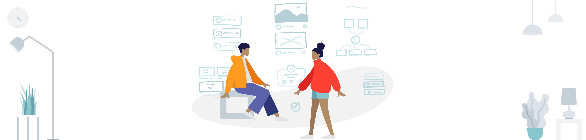

# IT Tools Collection

    	

Tools collection for product managers and UI/UX designers.
Subscribe to our [Telegram channel](https://tglink.me/lostdesign).

## Navigation

* [Collaboration Work](#collaboration-work)
* [Mockups Tools](#mockups-tools)
* [Design System Managment](#design-system-managment)

## Tools

### Collaboration Work

* [Witeboard](https://www.witeboard.com/) · Simple real-time whiteboard for collaboration work.
* [RealtimeBoard](https://www.realtimeboard.com/) · Whiteboarding platform for
cross-functional team collaboration.

### Mockup Tools
* [Rotato](https://rotato.xyz/) · Animated 3D mockups for your app designs.

### Design System Managment
* [Specify](https://specifyapp.com/) · All your design primitives, component states and platforms in one place.

